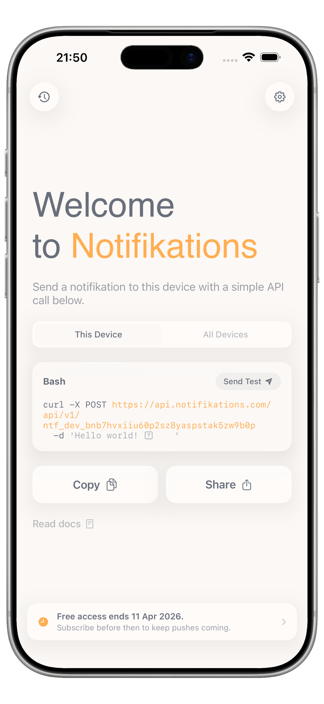
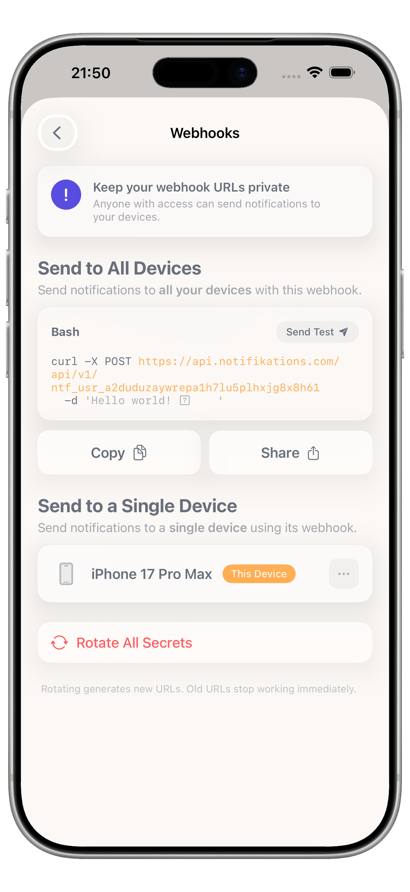
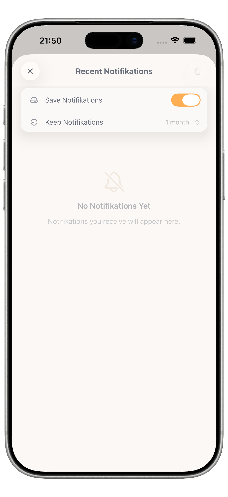
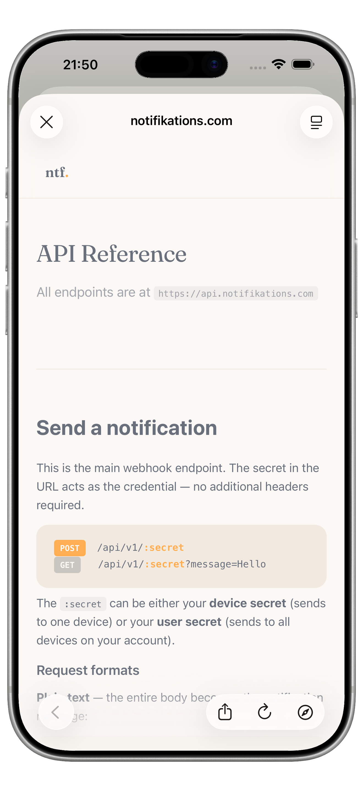

# Notifikations

Push notifications to your iPhone via a plain HTTP POST. No SDK, no account, no dashboard — just a webhook URL and a `curl` command.

<p align="center">
  
  
  
  
</p>

---

## What it is

Notifikations turns your iPhone into a notification endpoint. Install the app, copy your webhook URL, and POST to it from anywhere — a script, a CI job, an AI agent, a home automation system. The notification arrives instantly.

There are two webhook scopes:

- **Device** — delivers to the specific device that generated the URL
- **User** — delivers to all devices signed in to the same iCloud account (synced via CloudKit)

You can also create named webhooks to organize different notification sources.

---

## How it works

```
Client (curl / script / agent)
        |
        | POST /ntf/{secret_digest}
        v
Cloudflare Worker  ──  Cloudflare KV (device registry)
        |
        | APNs HTTP/2
        v
Apple Push Notification Service
        |
        v
iOS App (displays notification)
```

The secret never leaves your device in plain text. The iOS app generates a random secret, stores it in the Keychain, and only sends its SHA-256 digest to the backend. The worker stores the digest and uses it to authenticate incoming webhook calls.

---

## Stack

| Component | Technology |
|---|---|
| iOS app | Swift, SwiftUI, SwiftData, iOS 18+, CloudKit, APNs, RevenueCat |
| Backend | TypeScript, Hono, Cloudflare Workers, Cloudflare KV |
| n8n node | TypeScript, n8n community node SDK |
| Claude Code skill | Node.js, npm |
| Website | HTML, CSS, Cloudflare Pages |

---

## Repository structure

```
ios/                    iOS/iPadOS app (SwiftUI)
  Notifications/          Main app source
  NotificationsServiceExtension/  Downloads image attachments
  Config/                 XcodeGen config + Secrets.xcconfig.example
  screenshots/            App Store screenshots (raw, framed, review)
  project.yml             XcodeGen project definition

worker/                 Cloudflare Worker (TypeScript + Hono)
  src/
    index.ts              API routes and webhook handler
    lib/apns.ts           APNs HTTP/2 integration
    lib/kv.ts             Cloudflare KV helpers
    lib/types.ts          TypeScript interfaces
  wrangler.toml           Cloudflare deployment config

n8n-node/               n8n community node (npm: n8n-nodes-notifikations)
  nodes/Notifikations/    Node implementation
  credentials/            Credential definition

skill-package/          Claude Code skill (npm: @idanbuzaglo/notifikations)

website/                Static marketing site (Cloudflare Pages)
```

---

## Self-hosting

### Worker (Cloudflare)

**Prerequisites:** Cloudflare account, `wrangler` CLI, an Apple Developer account with APNs auth key.

1. Clone the repo and install dependencies:

   ```sh
   cd worker
   npm install
   ```

2. Create a KV namespace:

   ```sh
   npx wrangler kv namespace create NTF_KV
   npx wrangler kv namespace create NTF_KV --preview
   ```

   Update the `id` and `preview_id` values in `wrangler.toml` with the returned IDs.

3. Set secrets:

   ```sh
   npx wrangler secret put APNS_KEY_ID        # 10-character key ID from Apple Developer portal
   npx wrangler secret put APNS_TEAM_ID       # Your 10-character Apple Developer Team ID
   npx wrangler secret put APNS_KEY_P8        # base64-encoded .p8 file: base64 -i AuthKey_XXXXX.p8 | tr -d '\n'
   npx wrangler secret put APNS_BUNDLE_ID     # Your app's bundle ID (e.g. com.example.myapp)
   npx wrangler secret put RC_WEBHOOK_SECRET  # RevenueCat webhook secret (optional, for subscription sync)
   ```

4. Update `wrangler.toml` with your own route pattern if you are using a custom domain.

5. Deploy:

   ```sh
   npx wrangler deploy
   ```

### iOS app

**Prerequisites:** Xcode 16+, [XcodeGen](https://github.com/yonas/XcodeGen), an Apple Developer account with APNs entitlement, a RevenueCat account (or remove RevenueCat references if you do not need subscriptions).

1. Copy the secrets template:

   ```sh
   cp ios/Config/Secrets.xcconfig.example ios/Config/Secrets.xcconfig
   ```

   Fill in your RevenueCat API keys (or leave blank if not using RevenueCat).

2. Edit `ios/project.yml`:
   - Set `DEVELOPMENT_TEAM` to your Apple Developer Team ID
   - Update `bundleIdPrefix` and `bundleId` values from `com.idanbu` to your own prefix
   - Update the CloudKit container identifier to match your bundle ID

3. Generate the Xcode project:

   ```sh
   cd ios
   xcodegen generate
   ```

4. Open `ios/Notifications.xcodeproj` in Xcode, configure signing, and build.

The app points to `https://api.notifikations.com` by default. To use your own worker, update the base URL in `ios/Notifications/Services/Config.swift`.

---

## n8n node

A community node is published to npm so you can use Notifikations directly inside n8n workflows.

Install it from the n8n community nodes panel by searching for `n8n-nodes-notifikations`, or install manually:

```sh
npm install n8n-nodes-notifikations
```

The node supports all payload fields (title, subtitle, message, sound, open_url, image_url, action) and both device and user webhook scopes.

---

## Claude Code skill

A Claude Code skill lets AI coding sessions send you notifications when long tasks complete.

Install:

```sh
claude mcp add notifikations -- npx -y @idanbuzaglo/notifikations
```

Then use it in any Claude Code session:

```
send me a notification when the build finishes
```

---

## API reference

Send a notification with a plain HTTP POST:

```sh
curl -X POST https://api.notifikations.com/ntf/{your_webhook_secret} \
  -H "Content-Type: application/json" \
  -d '{
    "title": "Build complete",
    "message": "All tests passed",
    "sound": "cha_ching",
    "open_url": "https://example.com"
  }'
```

### Payload fields

| Field | Type | Description |
|---|---|---|
| `title` | string | Notification title |
| `subtitle` | string | Secondary line below title |
| `message` | string | Body text |
| `sound` | string | One of: `bell_ringing`, `brrr`, `bubble_ding`, `cat_meow`, `cha_ching`, `dog_barking`, `door_bell`, `duck_quack`, `upbeat_bells` |
| `open_url` | string | URL to open when notification is tapped |
| `image_url` | string | Image to attach (downloaded by the service extension) |
| `action` | string | Interactive action buttons: `yes_no`, `approve_dismiss`, `confirm` |
| `action_url` | string | Callback URL called with the user's action response |
| `schedule_at` | string | ISO 8601 datetime to deliver the notification in the future (up to 30 days) |

All fields except `title` are optional. Returns `200 OK` on success.

---

## License

MIT — see [LICENSE](LICENSE).
